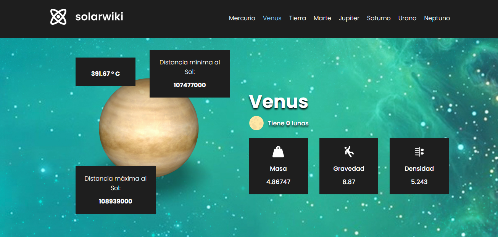

# Planets App

Planets Apps es una web en la que se puede encontrar contenido sobre diversos planetas del sistema solar. Funciona utilizando React JS, construído con Vite y desplegado a Vercel

---

## Apis y Paquetes Externos

La App utiliza una API llamada System Data para obtener los datos de cada planeta. Puedes encontrar información sobre esta API y sus creadores [Aquí](https://api.le-systeme-solaire.net/en/)

### Módulos Utilizados

- React Router DOM
- Iconify